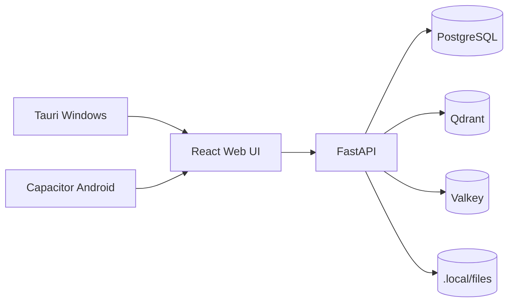

# Arquitetura

## Visao geral

Truth's Forge AI e uma aplicacao pessoal local-first. O desktop Windows e o centro computacional: roda FastAPI, Postgres, Qdrant, Valkey, workers locais e adapters de modelagem. O frontend React e compartilhado entre web, desktop e Android.



## Desenvolvimento containerizado

O fluxo de desenvolvimento recomendado roda tudo pelo Docker Compose:

- `backend`: FastAPI/uvicorn com reload, montando o repo em `/workspace`.
- `web`: Vite/pnpm com hot reload, expondo `5173`.
- `postgres`: dados relacionais e `pgvector`.
- `qdrant`: indice vetorial.
- `valkey`: cache/fila.

Use:

```powershell
docker compose --env-file infra\.env.example -f infra\docker-compose.yml -f infra\docker-compose.dev.yml up --build -d
```

## Backend

O backend esta organizado por dominios:

- `llm_gateway`: providers OpenAI, Anthropic e Google atras de `LLMProvider`.
- `judite`: orquestracao em portugues BR, roteamento, politicas e memoria.
- `agents`: runtime inicial com LangGraph/LangChain quando disponivel, selecao multiagente e checkpoints humanos futuros.
- `rag`: contrato `VectorStore`, embeddings locais de infraestrutura, filtros e Qdrant como indice principal.
- `files`: biblioteca de arquivos, chunking, parsing de PDF/Markdown/TXT/CSV/DOCX/HTML e OCR opcional para imagens.
- `prompts`: biblioteca e renderizacao de templates.
- `artifacts`: canvas e exportacoes futuras.
- `tools`: catalogo de ferramentas internas, avaliacao de permissoes e runtime seguro inicial. `rag.search` conclui validacao segura; `python.run` e `filesystem.write` ainda exigem aprovacao e retornam erro ate existir sandbox real.
- `security`: permissoes por agente/ferramenta.
- `audit`: trilha de envio a provedores e execucao de ferramentas.
- `cost_governor`: orcamento, estimativa e bloqueios.
- `workers`: filas em memoria para importacao do ChatGPT e indexacao de arquivos, com recuperacao/backfill de pendencias. Redis/Valkey permanece pronto para cache/fila distribuida futura.
- `modeling`: MCP local para Blender/Fusion, snapshots, tool calls, printability e artefatos 3D.

O store principal do modo containerizado e Postgres. Para o desenvolvimento principal e validacao do produto completo, Postgres + Qdrant + Valkey sao obrigatorios. O JSON-backed store permanece como fallback local para testes ou quando o banco nao estiver disponivel; ele nao e caminho de producao, sync ou backup.

## Dados

- Postgres guarda estado transacional: chats, mensagens, agentes, prompts, projetos, pastas, documentos, arquivos, bases de conhecimento, jobs de importacao, auditoria, politicas e modelagem 3D.
- Bases de conhecimento guardam colecoes curadas de documentos indexados; projetos e agentes apenas referenciam essas bases.
- Segredos de provedores ficam cifrados em `.local/state/secrets.json` quando nao vierem do ambiente.
- Qdrant guarda vetores e payloads indexaveis para RAG.
- Filesystem guarda arquivos grandes em `.local/files`.
- Valkey entra para filas/cache quando os workers sairem do modo em memoria.

## Modos de storage

- `TRUTHS_FORGE_STORAGE_BACKEND=postgres`: exige Postgres disponivel e falha rapido se o banco nao conectar. Use para validacao de producao local.
- `TRUTHS_FORGE_STORAGE_BACKEND=auto`: tenta Postgres e cai para JSON quando o banco nao esta disponivel. Use em desenvolvimento leve.
- `TRUTHS_FORGE_STORAGE_BACKEND=json`: usa apenas o dev store local. Use em testes automatizados, prototipos ou ambientes sem Docker.

Mesmo no modo `auto`, Qdrant continua sendo o indice vetorial esperado para RAG real. Se Qdrant nao estiver disponivel, buscas vetoriais podem retornar vazio ou operar apenas como scaffold.

## RAG e ranqueamento

O RAG nao envia todos os arquivos de uma base para a LLM. O backend usa as bases atreladas ao projeto atual e ao agente ativo, busca chunks semanticamente proximos no Qdrant, aplica filtros de escopo e boosts baratos de prioridade/pinagem, e so entao monta o contexto final do prompt.

Pastas de projetos sao organizacao visual e escopo humano. Quando citadas no chat, elas podem atuar como filtro opcional para restringir a busca, mas a fonte primaria de contexto sao as bases de conhecimento.

Documentos indexados podem compor prompts enviados aos provedores externos configurados, respeitando escopo e bases ativas. Conteudo sensivel deve ser identificado por marcacao manual e heuristica automatica, com rastreabilidade em auditoria.

## Agentes, tools e memoria

JUDITE deve evoluir como orquestradora de workflows multi-etapa: delega contexto para agentes especialistas, coordena checkpoints humanos e registra decisoes. Agentes podem executar adicoes sem aprovacao quando a policy permitir; alteracoes e delecoes exigem aprovacao humana.

Tools com escrita ou execucao devem operar em diretorio isolado por projeto, com rede permitida no MVP, timeout, limites de tamanho, auditoria e rollback obrigatorio. A memoria duravel deve cobrir preferencias do usuario, decisoes, historico resumido, contexto por projeto e demais sinais uteis.

## Mobile

O Android sera quase totalmente cliente do backend desktop. O pareamento inicial deve usar QR code local. No MVP mobile nao havera autenticacao de usuario; o cliente pareado pode manter cache offline completo. O caminho padrao fora de casa e Tailscale/WireGuard, evitando porta publica.
