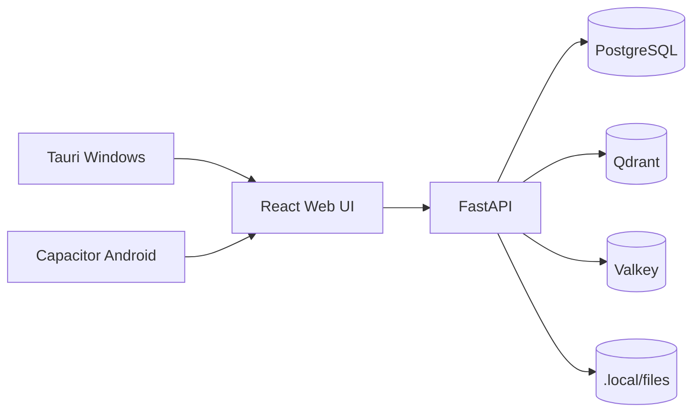

# Arquitetura

## Visao geral

Truth's Forge AI e uma aplicacao pessoal local-first. O desktop Windows e o centro computacional: roda FastAPI, Postgres, Qdrant, Valkey e workers. O frontend React e compartilhado entre desktop e Android.



## Desenvolvimento containerizado

O fluxo de desenvolvimento recomendado roda tudo pelo Docker Compose:

- `backend`: FastAPI/uvicorn com reload, montando o repo em `/workspace`.
- `web`: Vite/pnpm com hot reload, expondo `5173`.
- `postgres`: dados relacionais e `pgvector`.
- `qdrant`: indice vetorial.
- `valkey`: cache/fila.

Use:

```powershell
docker compose --env-file infra\.env.example -f infra\docker-compose.yml -f infra\docker-compose.dev.yml up --build -d
```

## Backend

O backend esta organizado por dominios:

- `llm_gateway`: providers OpenAI, Anthropic e Google atras de `LLMProvider`.
- `judite`: orquestracao em portugues BR, roteamento, politicas e memoria.
- `agents`: runtime com LangGraph/LangChain e checkpoints humanos.
- `rag`: contrato `VectorStore`, embeddings locais de infraestrutura e Qdrant como indice principal.
- `files`: storage de documentos, chunking inicial de texto/Markdown, parsing e OCR futuros.
- `prompts`: biblioteca e renderizacao de templates.
- `artifacts`: canvas e exportacoes futuras.
- `tools`: catalogo de ferramentas internas e sandbox.
- `security`: permissoes por agente/ferramenta.
- `audit`: trilha de envio a provedores e execucao de ferramentas.
- `cost_governor`: orcamento, estimativa e bloqueios.
- `workers`: jobs longos de indexacao, embedding, OCR e compactacao.

O store principal do modo containerizado e Postgres. O JSON-backed store permanece como fallback local para testes ou quando o banco nao estiver disponivel.

## Dados

- Postgres guarda estado transacional: chats, mensagens, agentes, prompts, documentos, auditoria e politicas.
- Bases de conhecimento guardam colecoes curadas de documentos indexados; projetos e agentes apenas referenciam essas bases.
- Segredos de provedores ficam cifrados em `.local/state/secrets.json` quando nao vierem do ambiente.
- Qdrant guarda vetores e payloads indexaveis para RAG.
- Filesystem guarda arquivos grandes em `.local/files`.
- Valkey entra para filas/cache em workers.

## RAG e ranqueamento

O RAG nao envia todos os arquivos de uma base para a LLM. O backend usa as bases atreladas ao projeto atual e ao agente ativo, busca chunks semanticamente proximos no Qdrant, aplica filtros de escopo e boosts baratos de prioridade/pinagem, e so entao monta o contexto final do prompt.

Pastas de projetos sao organizacao visual e escopo humano. Quando citadas no chat, elas podem atuar como filtro opcional para restringir a busca, mas a fonte primaria de contexto sao as bases de conhecimento.

## Mobile

O Android sera quase totalmente cliente do backend desktop. O caminho padrao fora de casa e Tailscale/WireGuard, evitando porta publica. O modo offline inicial deve ser cache local somente leitura com indicador visual de servidor indisponivel.
